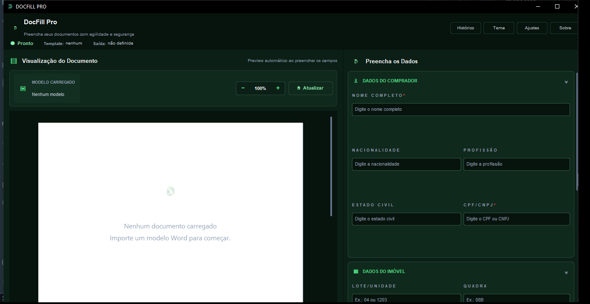

# DocFill Pro

**Português | [English](README.md)**

Um aplicativo desktop para Windows que preenche templates de contrato em Word (`.docx`) e PDF automaticamente. Aponte para uma declaração de compra e venda de imóvel, e ele lê o documento, encontra comprador, vendedor, CPF/CNPJ, lote, quadra, empreendimento, cidade e data sozinho, mostra um preview em folha A4 ao vivo, e gera uma cópia preenchida — sem nunca alterar o template original.



## Por que esse projeto existe

Uma imobiliária vinha preenchendo o mesmo template de declaração à mão para cada novo comprador: copiar um nome aqui, um CPF ali, redigitar lote/quadra/empreendimento, e depois reler tudo para pegar erros de digitação. O DocFill Pro substitui isso por um formulário, um preview ao vivo e um motor de detecção de campos que já sabe como é um contrato preenchido desse tipo.

## O que ele faz

- **Lê templates `.docx` e `.pdf`** — extrai parágrafos, tabelas, cabeçalhos/rodapés (DOCX) ou blocos de texto por página (PDF, via PyMuPDF).
- **Detecta campos automaticamente** a partir da linguagem jurídica natural (ex.: *"portador do CPF nº ..., na qualidade de COMPRADOR do Lote ... Quadra ... do LOTEAMENTO ..."*), com uma pontuação de confiança e o trecho exato que gerou o resultado, para que um palpite de baixa confiança nunca seja aceito silenciosamente.
- **Marca placeholders no texto existente** (`{{COMPRADOR}}`, `{{CPF_CNPJ}}`, ...) e substitui com segurança apenas as ocorrências exatas e inequívocas de um valor detectado — ele se recusa a substituir um valor que aparece mais de uma vez com significados diferentes.
- **Preview A4 ao vivo** com destaque de marcadores, zoom e contagem de páginas/palavras/caracteres; para PDFs, uma visualização renderizada onde você pode arrastar para selecionar uma área e mapeá-la manualmente para um campo.
- **Aprendizado por template**: cada template é identificado por hash, e as correções que você faz são lembradas na próxima vez que abrir o mesmo arquivo.
- **Sugestões baseadas em histórico**: ao digitar o nome de um comprador ou vendedor, o app procura nos documentos já gerados pela mesma pessoa e oferece preencher o resto (nacionalidade, profissão, cidade, ...), com pontuação por similaridade de nome, não só correspondência exata.
- **Autosave e restauração de sessão**: o formulário em andamento, o template e a pasta de saída são salvos automaticamente e oferecidos de volta na próxima abertura.
- **Interface multilíngue**: português, inglês e chinês.

## Stack técnica

Python 3.11+, [CustomTkinter](https://github.com/TomSchimansky/CustomTkinter) para a interface, [python-docx](https://python-docx.readthedocs.io/) para documentos Word, [PyMuPDF](https://pymupdf.readthedocs.io/) para renderização/edição de PDF, Pillow para manipulação de imagens, PyInstaller + Inno Setup para o instalador Windows.

## Como rodar

```bash
git clone https://github.com/bobspinoja-prog/docfill-pro.git
cd docfill-pro
python -m venv .venv
.venv\Scripts\activate        # Windows
pip install -r requirements.txt
python main.py
```

Os dados de execução (histórico, templates aprendidos, autosave) ficam por usuário em `%LOCALAPPDATA%\DocFillPro`, semeados a partir dos padrões vazios em `data/` no primeiro uso — rodar a partir do código-fonte nunca grava no repositório.

### Rodando os testes

```bash
pip install pytest
pytest -q
```

### Gerando o instalador Windows

```bash
pip install -r requirements-build.txt
pyinstaller "DOCFILL PRO.spec"
# depois compile installer/DocFillPro.iss com o Inno Setup
```

## Estrutura do projeto

```
main.py                      ponto de entrada
services/                    extração, geração de PDF/DOCX, persistência — sem código de UI
  field_extractor.py          motor de detecção de campos baseado em regex
  text_sections.py            divide o documento em preâmbulo/corpo/fecho/assinaturas
  template_semantic_analyzer.py  detecção por campo + confiança, aprende por hash de template
  semantic_replacements.py    decide quais valores detectados são seguros para substituição automática
  docx_reader.py / docx_writer.py   extração de preview DOCX / substituição de marcadores
  pdf_handler.py              extração, renderização e preenchimento de PDF
  history_manager.py / history_suggestions.py   histórico de documentos e sugestões entre documentos
  runtime_json_store.py       store JSON simples com escrita atômica, cache por mtime e semente do bundle
ui/                           widgets CustomTkinter (janela principal, formulário, preview, histórico)
tests/                        suíte de testes pytest
data/                         arquivos-semente vazios por padrão, copiados no primeiro uso
```

## Como funciona a detecção de campos

O documento é dividido em seções (preâmbulo, corpo, parágrafo final, bloco de assinaturas) usando frases-âncora conhecidas (`RECEBI`, `Assim, por todo o exposto`, uma linha final de "*cidade*, *data*"). Cada campo então é buscado na seção certa com um padrão específico para onde aquele campo de fato aparece nesse tipo de declaração — por exemplo, o nome do vendedor é procurado logo após uma cláusula de aquisição no preâmbulo, confirmado de novo no bloco de assinaturas, e marcado como conflito se o parágrafo final citar outra pessoa. Todo valor detectado carrega uma pontuação de confiança e o trecho que o originou, e só valores acima de um limite são usados para reescrever com segurança o documento original com `{{MARCADORES}}`.

## Limitações conhecidas / próximos passos

Este projeto foi construído sob medida para uma família específica de declarações de compra e venda de imóvel no Brasil — tanto o formulário fixo de 11 campos quanto as heurísticas de detecção assumem esse formato de documento, então a precisão cai rápido em um contrato com redação diferente. Duas frentes de refatoração ficam registradas para quem for continuar:

- `field_extractor.py` e `template_semantic_analyzer.py` hoje rodam duas passagens de detecção sobrepostas para os mesmos campos; deveriam compartilhar um único motor.
- `ui/main_window.py` mistura construção de interface com orquestração de negócio numa única classe grande; separar os diálogos (ajustes, histórico, seletor de área em PDF) em módulos próprios facilitaria muito estender o app.

## Licença

[MIT](LICENSE)
